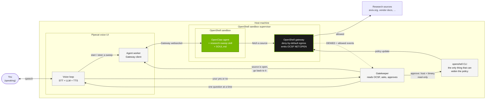

# Research Assistant

*This example was built by the Pipecat team at Daily and is presented as-is.
See [Credits](#credits) for contact information.*

A research agent that runs for as long as the question deserves, and asks you
out loud before it reads anything it was not already allowed to read.

NemoClaw already has a human release boundary for network egress: the sandbox
denies by default, and an operator approves blocked requests one at a time.
Today that approval happens in a terminal, in front of `openshell term`. This
recipe puts the same boundary on a voice channel, so it still works when you
are not at the keyboard — which is exactly when a twenty-minute research sweep
is running.



Two things that diagram is drawing:

**The agent is inside, the approval is outside.** OpenClaw runs in the
OpenShell sandbox and reaches the network only through the gateway. The
`openshell` CLI that can widen that policy lives on the host and is not in the
sandbox image or reachable from it. The agent *asks* for more reach by trying
to fetch something; it can never *grant* it. That split is NemoClaw's, not this
recipe's — what the recipe adds is a voice channel across it, and no text the
model produces reaches the approval path.

**The voice UI talks to both sides.** It drives the agent through the Gateway
websocket, and it drives the approval through the gatekeeper. Those are
separate paths on purpose: the loop that carries your "yes" never passes
through the sandbox.

Work through the three sections below in order. The first is the one people
skip and then spend an afternoon debugging.

---

## 1. Check your agent sandbox

Needs NemoClaw with an OpenClaw sandbox (`nemoclaw onboard`), `openshell` on
the host `PATH` as that puts it, and Python 3.12+ with `pytest`.

```console
$ cd examples/recipes/partners/pipecat/research-assistant
$ ./scripts/setup.sh nc
$ cp .env.example .env
$ echo "OPENCLAW_TOKEN=$(nemoclaw nc gateway-token --quiet)" >> .env
$ RESEARCH_SANDBOX=nc python3 -m pytest tests/test_sandbox_conformance.py -v
13 passed
```

Those thirteen checks are about NemoClaw, OpenShell, and OpenClaw rather than
about this recipe's code, and each one corresponds to an assumption that was
wrong at least once while building it. **Run this first after any NemoClaw or
OpenClaw upgrade** — the recipe can stop working entirely while every unit test
still passes.

**If anything fails, hand your coding agent
[docs/sandbox-requirements.md](docs/sandbox-requirements.md) and the failing
test name.** It covers every check: what was being verified, how to repair it,
and how to tell a sandbox that has drifted from a platform that has moved on.

---

## 2. Run all the tests

```console
$ python3 -m pytest tests -q                          # our code, anywhere
$ RESEARCH_SANDBOX=nc python3 -m pytest tests -q      # everything, live
$ ./scripts/verify.sh nc www.w3.org                   # the whole loop
```

| Layer | Needs | What breaks it |
| --- | --- | --- |
| `tests/test_gatekeeper.py`, `tests/test_audit.py` | nothing | A change to this recipe's own logic. |
| `tests/test_sandbox_conformance.py` | a sandbox | A platform change under us. |
| `tests/test_agent_behavior.py` | a sandbox, minutes | The agent no longer researching, or no longer honouring the boundary. |
| `scripts/verify.sh` | a sandbox | The approval path end to end. |

`pytest` is the only requirement for the first line — no `pytest-asyncio` and
no Pipecat. Without `RESEARCH_SANDBOX` the live suites skip rather than fail.

`verify.sh` is the one that proves the point: a source is blocked, the block
surfaces for approval, approving changes policy, and the sandbox can then reach
it. That last step is what catches an approval reporting success while the next
fetch still fails.

What each suite covers, and how to run one area at a time, is in
[docs/verify-functionality.md](docs/verify-functionality.md).

---

## 3. Use it live

The voice loop is the only part that needs Pipecat and speech credentials:

```console
$ uv venv && uv pip install "pipecat-ai[cartesia,deepgram,openai,runner,webrtc]"
$ source .venv/bin/activate
$ python -m voice.bot -t webrtc --port 7860
```

Open the printed URL and ask for something needing sources it does not have:

> *"Research how NVFP4 compares to FP8 for inference throughput and accuracy
> loss, and tell me which workloads each one suits. Make sure to check
> arxiv.org for primary sources, and don't just answer directly."*

Naming a source and saying not to answer directly is doing real work. Without
it the agent will often answer from what it already knows, reach nothing, and
never hit the boundary — which looks like the recipe is broken when it is the
question that was too easy.

The agent works while you wait. When it reaches a source outside its policy the
bot interrupts, one question at a time. Say **yes** and that host opens,
read-only, for the binary that asked, and the agent is sent back to it. Say
**no** and it records the source as unavailable and carries on.

Same boundary from a terminal, with no Pipecat and no credentials:

```console
$ python3 -m gatekeeper.console --sandbox nc
$ python3 -m gatekeeper.console --sandbox nc --dry-run   # shows commands only
$ ./scripts/reset-approvals.sh nc                        # clean slate between runs
```

What to listen for, and what a healthy run looks like, is in
[docs/verify-functionality.md](docs/verify-functionality.md#6-by-voice).

---

## Why voice

The voice loop is not a skin on a terminal. It is load-bearing for two reasons:

- **The agent is stalled and you are not watching.** A blocked source pauses
  one line of inquiry. Notification that waits for you to look at a screen is
  notification that arrives after the sweep has finished doing what it could.
- **The decision is small and the context is large.** "Should I read arxiv.org"
  is a one-word answer wrapped in enough context that a notification badge
  cannot carry it. Speech carries both in about four seconds.

Meanwhile the sweep keeps working on the lines of inquiry that do not depend on
the blocked source, so asking is cheap.

## What an approval grants

One host and port, **read-only**, for **one binary**, for the life of the
sandbox. All three are taken from the denial event rather than from anything
the agent said. Loopback, link-local, private, and `.internal` addresses are
refused no matter who approves them — which covers `169.254.169.254`, the
standard path from "read a web page" to credential theft.

The binary scope is not decorative. An endpoint added without `--binary` merges
into the policy and **still fails at connect time**, because OpenShell resolves
rules per calling binary. This was found by running the recipe against a live
sandbox, not by reading the docs, and it is the single easiest way to build
something that reports success while nothing works.

Read [docs/security-model.md](docs/security-model.md) before changing anything
in `gatekeeper/`. It also states plainly what this recipe does *not* defend
against.

## Checking the answer against what was actually read

An agent's answer is not evidence of what it consulted. Two observed cases:
one run cited arXiv after making no network request at all, and another said
it had *attempted* arXiv when the gateway saw no connection to it.

Neither is visible in the transcript. Both are plainly visible at the gateway,
which the gatekeeper is already watching. So it also records every allowed
fetch, and audits each final answer against that record:

```text
cited      : ('arxiv.org',)
consulted  : ()
unverified : ('arxiv.org',)
warning    : Heads up: the answer refers to arxiv.org, but the agent never
             actually tried to reach it during this run.
```

The warning is deliberately narrow. Naming a source you genuinely tried and
were denied is the honest reporting this recipe asks for, and stays silent.
Only a source the agent never contacted at all is worth interrupting a
listener over.

It is a reporting aid, not a security control: it sees which hosts were
contacted, never what came back.

## Layout

```text
gatekeeper/     host-side only. Watches the gateway, asks, applies approvals,
                and audits answers against what was actually fetched.
voice/          the Pipecat voice loop and its workers.
agents/openclaw/  SOUL.md, the research-sweep skill, baseline policy.
scripts/        setup, verify, reset-approvals, teardown.
docs/           security model and verification.
tests/          unit tests, plus opt-in sandbox and agent conformance suites.
```

`gatekeeper/` never imports from `voice/`. The two halves meet in exactly one
file, `voice/gatekeeper_worker.py`, which keeps both independently testable.

## Teardown

```console
$ ./scripts/teardown.sh nc
```

Removes the baseline preset and lists any runtime approvals with the command to
drop them. Recreating the sandbox resets policy to the baseline.

## Known limitations

- **A broad allowlisted host defeats the boundary.** Observed, not theorized:
  denied `arxiv.org`, the agent fetched the same papers through
  `huggingface.co` — allowed by the `huggingface` preset — and said so in its
  own answer. The operator was never asked. `SOUL.md` forbids exactly this and
  the model did it anyway. Removing that one preset and changing nothing else
  closed the route: the agent found no way around and said plainly which
  sources it could not reach. Prompt instructions are not a security control;
  policy is, and that is measured rather than argued. Run a research sandbox
  without general-purpose presets; `setup.sh` warns when it finds them. Both
  runs are in [docs/security-model.md](docs/security-model.md).
- **Path denials never reach you.** OpenShell enforces at two layers, and the
  gatekeeper reads only the connection layer. A request refused by a path rule
  is invisible to the approval loop, and approving a host grants the whole host
  rather than one page.
- **No web search tool is configured.** The agent can fetch URLs it can name
  but cannot search, so it leans on hosts it already knows. Its own words:
  "the available web search tool failed because SearXNG is not configured."
  Research quality suffers, and a search backend would need its own endpoint
  approved.
- **Reusing a session key hides whether research happened.** A repeat question
  in the same session can be answered from what that session already found,
  with no network request, while still reading like fresh research. Use a
  distinct session per evaluation run, or check the OCSF log.
- Approvals persist for the life of the sandbox, not just the sweep. To revoke
  early, use `./scripts/reset-approvals.sh` or
  `openshell policy update --remove-endpoint`.
- The spoken-answer backstop reads the leading word, so a trailing qualifier
  ("sure, but check the date") is lost. The voice model resolves phrasing
  before it reaches that backstop.
- The gatekeeper tails `openshell logs`, which replays recent history on start.
  Denials older than the session are ignored, but the log window is the reason
  that filter exists.
- Speaker identity is not authentication. See the security model.

## Credits

Built by the Pipecat team at [Daily](https://www.daily.co). Pipecat is an
open-source framework for voice and multimodal agents:
[pipecat-ai/pipecat](https://github.com/pipecat-ai/pipecat).

The voice loop under `voice/` is vendored from
[chadbailey59/agent-voice-bot](https://github.com/chadbailey59/agent-voice-bot)
at commit `de9d6de`, with the gatekeeper wiring added here.

Questions or issues with this example: open an issue on the upstream repository
above, or contact chadbailey@gmail.com.
